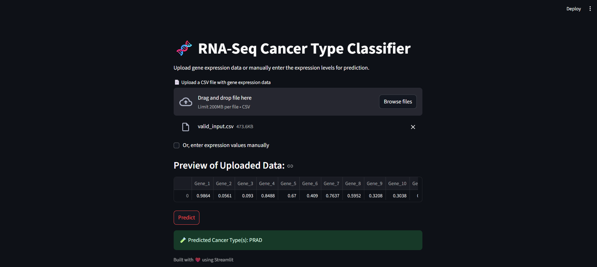

# 🧬 RNA-Seq Cancer Type Classifier (Deep Learning with Streamlit)

This project is an interactive web app built with **Streamlit** that predicts the type of cancer based on **gene expression data** (RNA-Seq). It uses a deep learning model (Keras Sequential) trained on the **PANCAN HiSeq Dataset**, which includes five tumor types:

- 🟣 BRCA (Breast Invasive Carcinoma)  
- 🔵 KIRC (Kidney Renal Clear Cell Carcinoma)  
- 🟢 COAD (Colon Adenocarcinoma)  
- 🟠 LUAD (Lung Adenocarcinoma)  
- 🔴 PRAD (Prostate Adenocarcinoma)

---

## 📁 Project Structure

```

RNA\_SEQ\_Cancer\_Classifier/
│
├── train.py               # Script to train the model (.h5 file)
├── app.py                 # Streamlit web app
├── model.h5               # Trained Keras model
├── label\_encoder.pkl      # Label encoder for cancer types
├── requirements.txt       # Dependencies list
├── sample\_input.csv       # Sample input for testing
└── README.md              # Project documentation

````

---

## 🛠 Features

- Upload your `.csv` file with 16,383 gene expression values to predict the cancer type.
- Or, manually input values in the app for testing.
- Interactive, stylized output display.
- Built using `TensorFlow`, `Keras`, and `Streamlit`.

---

## 🚀 How to Run the App

### 1. Clone the Repository
```bash
git clone https://github.com/your-username/RNA_SEQ_Cancer_Classifier.git
cd RNA_SEQ_Cancer_Classifier
````

### 2. Create Environment (Recommended)

```bash
python -m venv rna-env
.\rna-env\Scripts\activate     # Windows
```

### 3. Install Dependencies

If using **Python 3.10**, recommended versions:

```bash
pip install -r requirements.txt
```

### 4. Run the Streamlit App

```bash
streamlit run app.py
```

---

## 📂 Sample Input Format

Ensure your uploaded `.csv` follows this:

```csv
gene_1,gene_2,...,gene_16383
0.212,1.123,...,0.052
```

You can use the included `sample_input.csv` for testing.

---

## 🧠 Model Info

* **Architecture**:

  * Input: 16,383 gene expression features
  * Hidden Layers: 512 → 256 with ReLU and Dropout
  * Output: 5 softmax neurons (one per cancer type)
* **Optimizer**: Adam
* **Loss**: Categorical Crossentropy
* **Accuracy**: \~93% on validation set

---

## 📦 Requirements

Here are the key packages:

```txt
numpy==1.23.5
pandas==1.5.3
tensorflow==2.11.0
scikit-learn==1.2.2
streamlit==1.24.0
matplotlib==3.6.3
seaborn==0.12.2
```

> These versions avoid dependency conflicts (especially with `protobuf`).

---

## 🧪 Demo Preview



---

## ❤️ Credits

Developed by Mohammed Abu Hurer
Dataset: [PANCAN HiSeq RNA Expression](https://www.cancer.gov/about-nci/organization/ccg/research/structural-genomics/tcga)

---

## 📜 License

MIT License – feel free to use, modify, and share.

---
